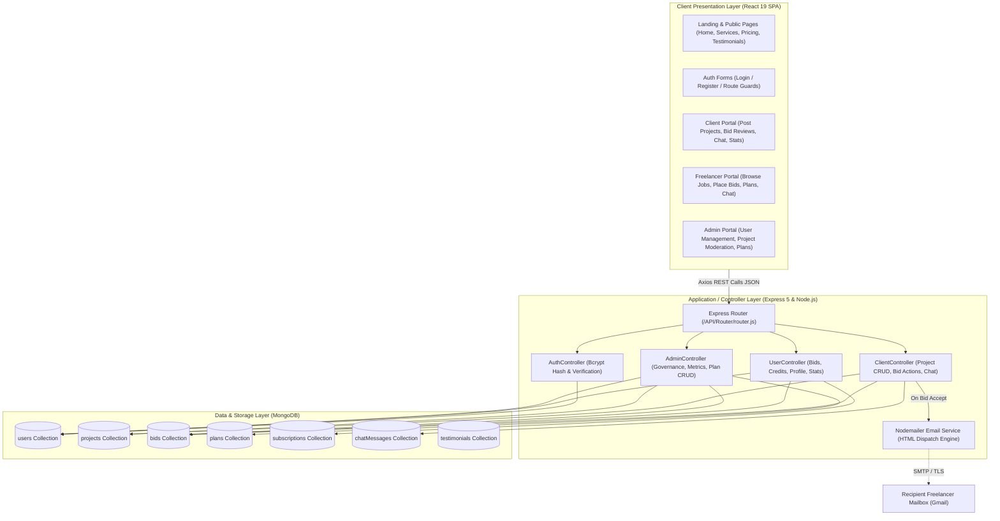
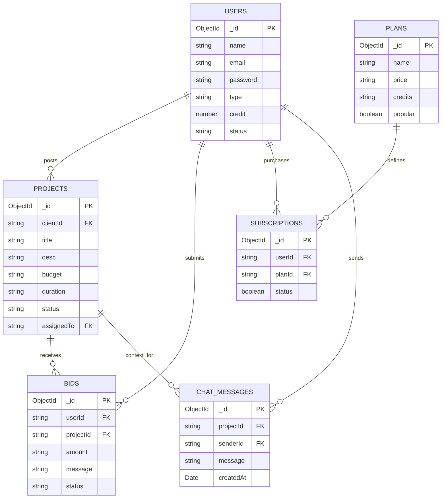
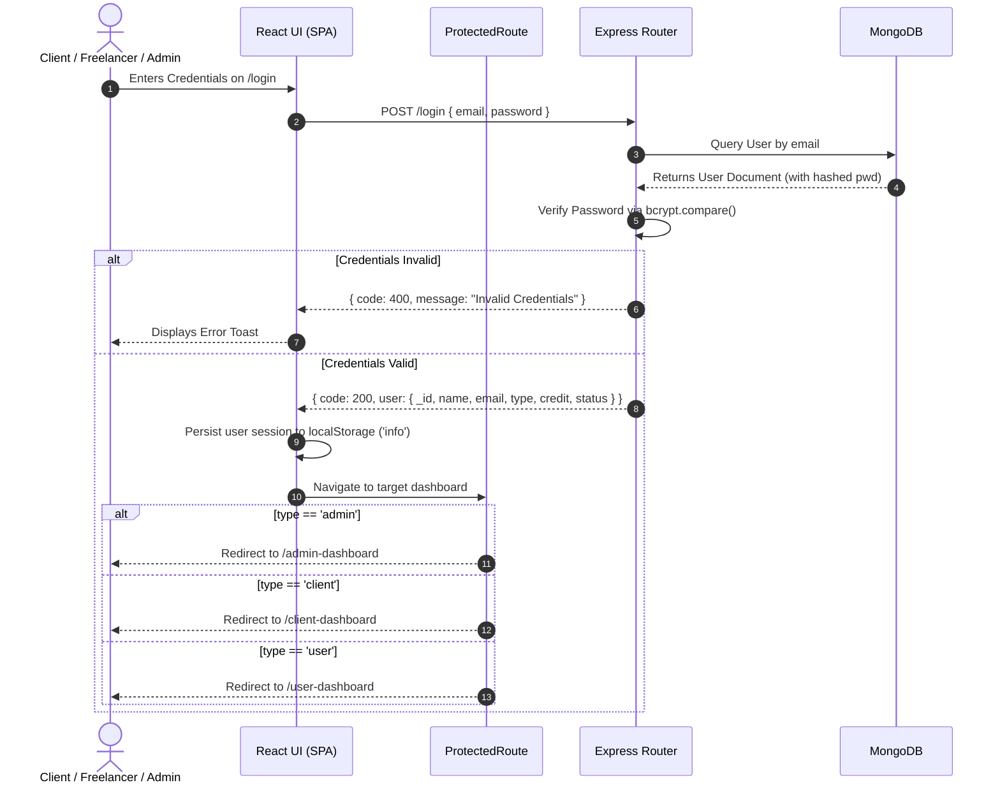
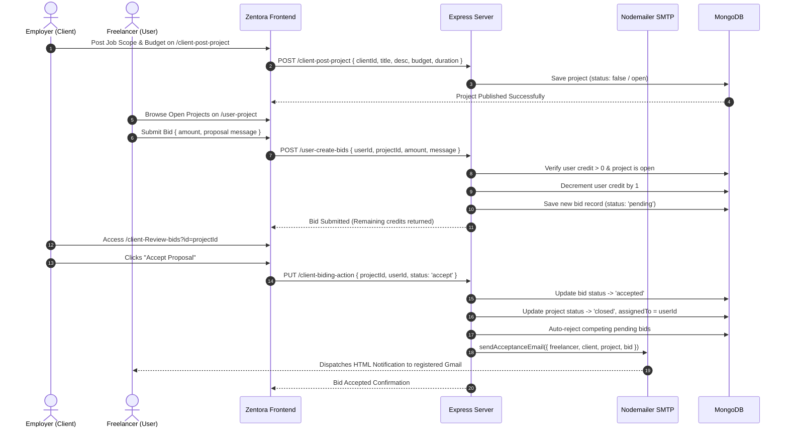
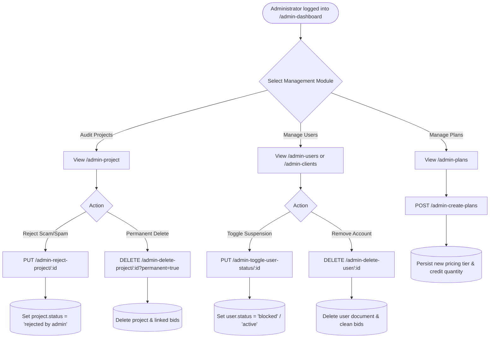

# PROJECT SYNOPSIS: ZENTORA FREELANCE MARKETPLACE

---

## 1. Project Overview & Meta Information

| Parameter | Specification |
| :--- | :--- |
| **Project Title** | **Zentora** — Full-Stack Multi-Tenant Freelance Marketplace & Talent Collaboration Platform |
| **Project Category** | Enterprise Web Application / Gig Economy Marketplace |
| **Architecture** | Client-Server Architecture / RESTful Micro-Services / Single-Page Application (SPA) |
| **Primary Domain** | Online Freelancing, Talent Acquisition, Proposal Bidding, Direct Communication & Escrow |
| **Target User Roles** | 1. **Client (Employer)** &nbsp;•&nbsp; 2. **Freelancer (User/Talent)** &nbsp;•&nbsp; 3. **Platform Administrator** |
| **Frontend Stack** | React 19, Vite, React Router DOM v7, React Hook Form, Yup, Bootstrap 5, React Icons, SweetAlert2, Axios, AOS |
| **Backend Stack** | Node.js (ES Modules), Express.js 5, Mongoose 9, Bcryptjs, Nodemailer (HTML Email Dispatch), CORS, Dotenv |
| **Database Engine** | MongoDB (NoSQL Document Database) |

---

## 2. Abstract & Problem Statement

### 2.1 Abstract
**Zentora** is an end-to-end full-stack freelance marketplace engineered to bridge the divide between global employers (Clients) and independent professionals (Freelancers). Modern gig-economy platforms often burden users with exorbitant middleman commissions, high friction during project negotiation, opaque hiring lifecycles, and fragmented post-proposal communication. 

Zentora addresses these inefficiencies by introducing a unified, role-segregated environment. Clients can post job openings with explicit parameters (budget, timeline, scope) and evaluate real-time competitive proposals. Freelancers can manage bid balances via a credit economy, submit proposals, track proposal statuses, and instantly trigger direct collaboration upon bid acceptance. Crucially, the platform features an automated email notification system (powered by Nodemailer with rich HTML templates) and an in-app project-level messaging hub to ensure transparency, accountability, and seamless interaction from job posting to contract award.

### 2.2 Problem Statement
Traditional hiring channels and existing freelancing ecosystems suffer from:
1. **Opaque & Delayed Communication**: Freelancers frequently submit bids with zero visibility into whether the client has viewed, accepted, or rejected their proposals.
2. **Spam & Proposal Flood**: Open marketplaces without bid throttle mechanisms suffer from low-quality automated bids, deteriorating the employer experience.
3. **Complex Onboarding & Fragmented Portals**: Many platforms lack clean role separation, confusing users who both post jobs and offer services.
4. **Lack of Centralized Moderation**: Without active administrative oversight, fraudulent listings, abusive profiles, and spam bids degrade platform integrity.

### 2.3 Proposed Solution & Innovation
* **Role-Based Workspaces**: Strict role-based routing (`/client-*`, `/user-*`, `/admin-*`) with route guards preventing privilege escalation.
* **Credit-Throttled Bidding Economy**: Freelancers utilize bidding credits, replenishing them via tiered Master Plans. This guarantees high-intent, thoughtful proposals.
* **Instant Multi-Channel Notification**: Bid acceptance instantly dispatches a customized HTML email containing complete client contact info and project scope to the freelancer's registered Gmail inbox, alongside state updates in the app.
* **Dedicated Project Chat Hub**: Post-acceptance communication is facilitated through a dedicated project messaging module.
* **Granular Administrative Governance**: Admin portal with instantaneous user status toggle (active/blocked), soft/hard project moderation, bid auditing, and revenue/master plan creation.

---

## 3. System Architecture & High-Level Design



---

## 4. Complete Database Schema & Data Dictionary

The persistence tier is built on MongoDB utilizing Mongoose 9 ODM schemas located in `API/Module/module.js`.

### 4.1 Users Collection (`users`)
Stores profile, credentials, role categorization, contact coordinates, professional skillsets, and bidding credits.

| Field Name | Data Type | Constraints / Defaults | Description |
| :--- | :--- | :--- | :--- |
| `_id` | `ObjectId` | Primary Key, Auto-generated | Unique identifier for user entity |
| `name` | `String` | Required | Full personal name or company name |
| `email` | `String` | Required, Unique, Indexed | Unique contact and login identifier |
| `password` | `String` | Required | Bcrypt salted and hashed secret |
| `type` | `String` | Enum: `'client'`, `'user'`, `'admin'` | Role discriminator determining portal access |
| `phone` | `String` | Optional, Default: `""` | Primary telephone / WhatsApp contact |
| `location` | `String` | Optional, Default: `""` | Geographic city/state/country |
| `bio` | `String` | Optional, Default: `""` | Professional summary / company profile |
| `headline` | `String` | Optional, Default: `""` | Professional headline (e.g. *Full Stack Dev*) |
| `rate` | `String` | Optional, Default: `""` | Hourly / milestone billing rate (e.g. *₹1500/hr*) |
| `skill` | `String` | Optional, Default: `""` | Comma-separated technical capabilities |
| `company` | `String` | Optional, Default: `""` | Organization name for clients |
| `department` | `String` | Optional, Default: `""` | Internal division or business domain |
| `credit` | `Number` | Default: `0` | Available bid submission credits (Freelancers) |
| `status` | `Mixed` | Default: `true` / `'active'` | Account governance (`'active'` / `'blocked'`) |
| `createdAt` | `Date` | Default: `Date.now` | Account registration timestamp |

---

### 4.2 Projects Collection (`projects`)
Maintains job vacancies posted by Clients with budgetary boundaries, scopes, and lifecycle status.

| Field Name | Data Type | Constraints / Defaults | Description |
| :--- | :--- | :--- | :--- |
| `_id` | `ObjectId` | Primary Key, Auto-generated | Unique project ID |
| `clientId` | `String` | Foreign Key (`users._id`) | Reference ID of employer client |
| `client` | `String` | Optional Fallback | Client name/identifier alias |
| `title` | `String` | Required | Project heading / contract title |
| `desc` | `String` | Required | Full requirement scope and deliverables |
| `description`| `String` | Alias Fallback | Secondary description alias |
| `budget` | `String` | Required | Contract financial budget (e.g. *₹85,000*) |
| `duration` | `String` | Optional | Estimated delivery timeframe (e.g. *1 Month*) |
| `time` | `String` | Alias Fallback | Duration alias |
| `timeline` | `String` | Alias Fallback | Delivery milestone alias |
| `status` | `Mixed` | Default: `false` | Status: `false` (Open), `'closed'`, `'rejected by admin'` |
| `assignedTo` | `String` | Optional, FK (`users._id`) | Freelancer awarded the contract |
| `closedAt` | `Date` | Optional | Timestamp when bid was awarded |
| `createdAt` | `Date` | Default: `Date.now` | Publication timestamp |

---

### 4.3 Bids Collection (`bids`)
Records proposals tendered by Freelancers against specific open projects.

| Field Name | Data Type | Constraints / Defaults | Description |
| :--- | :--- | :--- | :--- |
| `_id` | `ObjectId` | Primary Key, Auto-generated | Unique bid entity identifier |
| `userId` | `String` | Foreign Key (`users._id`) | Freelancer submitting the bid |
| `projectId` | `String` | Foreign Key (`projects._id`) | Target job vacancy |
| `amount` | `String` | Required | Proposed fee / bid quotation |
| `message` | `String` | Default: `""` | Pitch letter, deliverable strategy, notes |
| `status` | `String` | Default: `'pending'` | Lifecycle: `'pending'`, `'accepted'`, `'rejected'` |
| `createdAt` | `Date` | Default: `Date.now` | Bid placement timestamp |

---

### 4.4 Master Plans Collection (`plans`)
Configurable credit bundles made available by Administrators for Freelancer procurement.

| Field Name | Data Type | Constraints / Defaults | Description |
| :--- | :--- | :--- | :--- |
| `_id` | `ObjectId` | Primary Key, Auto-generated | Unique plan identifier |
| `name` | `String` | Required (e.g. *Starter*, *Pro*) | Package branding title |
| `price` | `String` | Required (e.g. *₹99*, *₹299*) | Plan subscription price |
| `credits` | `String` | Required (e.g. *10*, *50*) | Number of bidding credits granted |
| `tagline` | `String` | Optional | Promotional marketing subtext |
| `features` | `String` | Optional | Feature bullet points (comma-delimited) |
| `popular` | `Boolean` | Default: `false` | Highlight badge indicator on UI |
| `status` | `Boolean` | Default: `true` | Plan active visibility status |
| `createdAt` | `Date` | Default: `Date.now` | Plan configuration creation date |

---

### 4.5 Subscriptions Collection (`subscriptions`)
Audit ledger of plan purchase transactions executed by Freelancers.

| Field Name | Data Type | Constraints / Defaults | Description |
| :--- | :--- | :--- | :--- |
| `_id` | `ObjectId` | Primary Key, Auto-generated | Subscription ledger ID |
| `userId` | `String` | Foreign Key (`users._id`) | Freelancer purchasing the plan |
| `planId` | `String` | Foreign Key (`plans._id`) | Master plan acquired |
| `status` | `Boolean` | Default: `true` | Active subscription confirmation |
| `createdAt` | `Date` | Default: `Date.now` | Transaction date |

---

### 4.6 Chat Messages Collection (`chatMessages`)
Project-scoped direct messaging trail between Client and assigned Freelancer.

| Field Name | Data Type | Constraints / Defaults | Description |
| :--- | :--- | :--- | :--- |
| `_id` | `ObjectId` | Primary Key, Auto-generated | Unique message ID |
| `projectId` | `String` | Foreign Key (`projects._id`) | Linked project context |
| `bidId` | `String` | Optional, FK (`bids._id`) | Linked bid reference |
| `senderId` | `String` | Foreign Key (`users._id`) | Author user ID |
| `senderName`| `String` | Default: `'User'` | Author visual display name |
| `senderRole`| `String` | Default: `'user'` | Role tag (`'client'`, `'user'`, `'admin'`) |
| `receiverId`| `String` | Optional, FK (`users._id`) | Target recipient ID |
| `message` | `String` | Required, Trimmed | Text payload content |
| `createdAt` | `Date` | Default: `Date.now` | Message dispatch timestamp |

---

### 4.7 Testimonials Collection (`testimonials`)
Verified user reviews displayed on the public landing page.

| Field Name | Data Type | Constraints / Defaults | Description |
| :--- | :--- | :--- | :--- |
| `_id` | `ObjectId` | Primary Key, Auto-generated | Unique testimonial ID |
| `name` | `String` | Required | Reviewer name |
| `role` | `String` | Default: `""` | User designation (e.g. *Senior Architect*) |
| `rating` | `Number` | Required, Min: `1`, Max: `5` | Star rating score |
| `review` | `String` | Required | Testimonial text feedback |
| `avatar` | `String` | Default: `""` | Profile avatar URL |
| `isApproved`| `Boolean` | Default: `true` | Public display moderation flag |
| `createdAt` | `Date` | Default: `Date.now` | Review posting timestamp |

---

### 4.8 Entity Relationship (ER) Diagram



---

## 5. System Workflows & Flow Diagrams

### 5.1 User Authentication & Role-Based Redirection Flow
Every incoming user registers with a specified role or logs in. Session data is persisted in local storage and evaluated by `ProtectedRoute.jsx`.



---

### 5.2 Project Posting, Bidding & Acceptance Lifecycle
Demonstrating the end-to-end flow from client job creation to bid submission, automated credit deduction, client bid acceptance, and email dispatch.



---

### 5.3 Administrative Moderation & Platform Governance Flow
Administrators monitor platform health, reject bad projects, ban malicious actors, and publish new subscription packages.



---

## 6. Comprehensive REST API Reference & Specification

All API endpoints are implemented in `API/Router/router.js` and hosted on `http://localhost:9000`.

### 6.1 Authentication & Profile APIs

#### `POST /register`
* **Description**: Registers a new Client or Freelancer account with encrypted password storage.
* **Access**: Public
* **Request Body**:
  ```json
  {
    "name": "Alex Mercer",
    "email": "alex@example.com",
    "password": "Password123",
    "type": "client"
  }
  ```
* **Success Response (200 OK)**:
  ```json
  {
    "code": 200,
    "success": true,
    "message": "User registered successfully",
    "result": {
      "_id": "6740f1a2b...",
      "name": "Alex Mercer",
      "email": "alex@example.com",
      "type": "client",
      "credit": 0,
      "status": true
    },
    "error": false
  }
  ```

#### `POST /login`
* **Description**: Verifies credentials and authenticates session.
* **Access**: Public
* **Request Body**:
  ```json
  {
    "email": "alex@example.com",
    "password": "Password123"
  }
  ```
* **Success Response (200 OK)**: Returns user profile (excluding password hash) for local session storage.

#### `GET /get-profile`
* **Description**: Retrieves full profile attributes for the logged-in user.
* **Access**: Authenticated (`userId` query param)
* **Query Params**: `?userId=6740f1a2b...`

#### `PUT /update-profile`
* **Description**: Modifies bio, headline, hourly rate, skillsets, contact details, or password.
* **Access**: Authenticated
* **Request Body**: Accepts `userId`, `name`, `headline`, `rate`, `skill`, `location`, `bio`, `currentPassword`, `newPassword`.

---

### 6.2 Client Operation APIs

| Method | Endpoint | Query / Body Params | Functional Description |
| :--- | :--- | :--- | :--- |
| `GET` | `/client-stats` | `?clientId={id}` | Returns counts: `totalProjects`, `totalBids`, `acceptedBids` |
| `POST` | `/client-post-project` | `{ clientId, title, desc, budget, duration }` | Posts a new project into the open marketplace |
| `GET` | `/client-project-list` | `?clientId={id}` | Fetches all projects posted by this employer |
| `DELETE` | `/client-delete-project/:id` | Route param `:id` | Deletes a project and all associated proposals |
| `GET` | `/client-biding-list` | `?projectId={id}` | Fetches all proposals received for a specific project with bidder profiles |
| `PUT` | `/client-biding-action` | `{ projectId, userId, status: 'accept'/'reject' }` | Awards contract, sets project to closed, and triggers automated acceptance email |

---

### 6.3 Freelancer (User) Operation APIs

| Method | Endpoint | Query / Body Params | Functional Description |
| :--- | :--- | :--- | :--- |
| `GET` | `/user-stats` | `?userId={id}` | Returns credits balance, total bids placed, accepted contracts, and total earnings |
| `GET` | `/user-projects-list` | None | Retrieves all active and open marketplace projects |
| `POST` | `/user-create-bids` | `{ userId, projectId, amount, message }` | Validates credits, deducts 1 credit, and registers bid |
| `GET` | `/user-get-bids` | `?userId={id}` | Returns all proposals submitted by the freelancer with live status |
| `POST` | `/user-purchase-plan` | `{ userId, planId }` | Credits account balance with purchased plan quota and logs subscription |

---

### 6.4 Project-Level Chat & Messaging APIs

#### `POST /chat-send-message`
* **Description**: Sends an in-app message under an active project collaboration.
* **Request Body**:
  ```json
  {
    "projectId": "6740d7c...",
    "bidId": "6740e5a...",
    "senderId": "6740a1b...",
    "senderName": "Apex Tech Solutions",
    "senderRole": "client",
    "receiverId": "6740b2c...",
    "message": "Welcome aboard! Let's schedule the architecture sync."
  }
  ```

#### `GET /chat-messages`
* **Description**: Queries chronological chat history for a project.
* **Query Params**: `?projectId=6740d7c...`
* **Response**: Chronological array of message objects with author name, role, timestamp, and message body.

---

### 6.5 Administrative Governance APIs

| Method | Endpoint | Query / Body Params | Functional Description |
| :--- | :--- | :--- | :--- |
| `GET` | `/admin-stats` | None | Returns platform-wide aggregate counts of users, clients, and projects |
| `GET` | `/admin-users-list` | None | Lists all registered Freelancer accounts with full profile metadata |
| `GET` | `/admin-clients-list`| None | Lists all registered Client employer accounts |
| `PUT` | `/admin-toggle-user-status/:id` | Route `:id` | Instantly toggles user between `'active'` and `'blocked'` |
| `DELETE` | `/admin-delete-user/:id` | Route `:id` | Permanently deletes account and cascades removal of bids |
| `GET` | `/admin-projects-list` | None | Retrieves complete global catalog of all projects |
| `PUT` | `/admin-reject-project/:id` | Route `:id` | Soft-rejects project (`'rejected by admin'`) hiding it from bidding |
| `DELETE` | `/admin-delete-project/:id` | Route `:id`, `?permanent=true` | Completely purges project and linked bids |
| `POST` | `/admin-create-plans` | `{ name, price, credits, tagline, features, popular }` | Publishes a new bidding credit package |
| `GET` | `/admin-get-plans` | None | Fetches all Master Plans |
| `DELETE` | `/admin-delete-plan/:id` | Route `:id` | Removes a plan from marketplace |
| `GET` | `/admin-bids-list` | None | System-wide audit log of every proposal submitted on platform |
| `PUT` | `/admin-bid-action` | `{ bidId, status }` | Overrides status of any bid |

---

## 7. Live Web Application Output & Visual Gallery

The following real screenshots demonstrate the live Zentora application running in production mode.

### 7.1 Homepage & Hero Section
The landing page greets visitors with an interactive navigation header, animated CTA buttons, and a live counter showcasing vetted talent.


* **Key Components**:
  * Brand Identity (`Zentora`), primary navigation links (`Home`, `About Us`, `Services`, `Pricing`, `Contact Us`, `Register`, `Login`).
  * Headline: *"Where Talent Meets Opportunity with Zentora"*.
  * High-visibility badge indicating *"10k+ Vetted Experts"*.

---

### 7.2 Talent Categories & Core Value Proposition
Visitors can explore talent across 9 major professional sectors alongside Zentora's platform guarantees.


* **Key Highlights**:
  * Interactive category cards: Web & Software Dev, Design & Creative, Writing & Translation, Data Science, Marketing, etc.
  * Three pillars of trust: **Expert Freelancers**, **Safe Escrow Payments**, and **24x7 Priority Support**.

---

### 7.3 Trending Contracts & Live Project Listings
Displays fixed-price contracts currently seeking bids, illustrating how jobs appear in the marketplace.


* **Marketplace Features**:
  * Displays projects such as *E-commerce Website Dev (₹85,000)*, *Grow Personal Financial Security (₹45,000)*, and *Competitive Strategy Law (₹32,000)*.
  * Real-time badges for delivery duration, budget, and proposal submission.

---

### 7.4 Platform Metrics & Community Testimonials
Demonstrates platform adoption metrics and genuine user reviews.


* **Metrics Displayed**:
  * 32k+ Registered Freelancers, 8,768+ Completed Contracts, 4,567 Top Freelancers, 100% Satisfaction Rate.
  * Testimonial carousel featuring feedback from clients and service providers.

---

### 7.5 Marketplace Services Directory (`/services`)
A structured catalog of specialized freelance solutions provided by platform professionals.


* **Offerings Outlined**:
  * Web & Software Development, UI/UX & Product Design, Mobile App Development, Digital Marketing & SEO, Content Writing, Data Science & Analytics, Branding, and Cybersecurity/DevOps.

---

### 7.6 Freelancer Credit Pricing Plans (`/pricing`)
Illustrates the credit economy where freelancers acquire bidding quotas.


* **Business Logic**:
  * 1 bid costs 1 credit.
  * Job posting is 100% free for clients.
  * Display of the popular **Starter Plan (₹99 / 10 credits)** with priority visibility and enhanced portfolio benefits.

---

### 7.7 Authentication & Role-Based Registration Portals
Streamlined sign-in and account creation forms with role selection.


* **Security & Validation Highlights**:
  * Clean form inputs with real-time validation via Yup schema.
  * Role selection dropdown: *Client — I want to hire* vs. *Freelancer — I want to work*.
  * Notice safeguarding administrative roles against unauthorized registration.

---

## 8. Hardware & Software Requirements

### 8.1 Software Specifications
* **Operating System**: Cross-platform (Windows 10/11, macOS, Linux / Ubuntu 22.04 LTS).
* **Runtime Environment**: Node.js v18.x or v20.x LTS.
* **Package Manager**: npm v9+ / pnpm / yarn.
* **Database Server**: MongoDB Community Server v6.0+ or MongoDB Atlas Cloud.
* **Browser Compatibility**: Modern Evergreen Browsers (Google Chrome 110+, Mozilla Firefox 110+, Microsoft Edge, Safari 16+).

### 8.2 Minimum Hardware Requirements
* **Processor**: Dual-Core 2.0 GHz Intel/AMD/Apple Silicon or higher.
* **System Memory (RAM)**: 4 GB minimum (8 GB recommended for simultaneous Vite HMR + Express server + MongoDB instance).
* **Storage Space**: 500 MB free disk space for application code and dependencies.
* **Network Connectivity**: Broadband connection (required for initial dependency installation, Google Fonts CDN, and Nodemailer SMTP relay).

---

## 9. Future Enhancements & Roadmap

1. **Payment Gateway & Escrow Integration**: Implementation of Razorpay and Stripe webhooks for real-time INR/USD milestone escrow deposits and automatic payout disbursals.
2. **WebSocket Real-Time Chat**: Upgrading polling/HTTP chat to bidirectional WebSockets (Socket.io) with typing indicators and unread count badges.
3. **Automated AI Proposal Assistant**: Integrating LLM-assisted proposal drafting to help freelancers create tailored pitches based on project requirements.
4. **Milestone Deliverable Auditing**: Multi-stage milestone tracking where clients release funds incrementally upon verified code/asset submission.
5. **Mobile Application (React Native)**: Native iOS and Android applications utilizing the existing Express REST backend.

---

## 10. Conclusion

The **Zentora Freelance Marketplace** represents a robust, modern, and production-ready solution addressing the operational challenges of contemporary gig-economy platforms. By coupling an intuitive React 19 user interface with an Express 5 and MongoDB backend, Zentora delivers strict role separation, spam-deterrent credit bidding, instant HTML email notifications, and administrative moderation. The modularity of its architecture positions Zentora as an extensible foundation ready for commercial deployment and scale.
